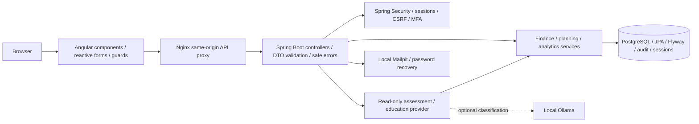

# Monelytics

A personal finance application for understanding spending, planning budgets, tracking bills and building savings. Built with **Angular, TypeScript, JavaScript, HTML, CSS, Java 21, Spring Boot, PostgreSQL, Docker**, and tested **Amazon Web Services (AWS) CDK** architecture references.

The app uses **Monelytics**, an **M monogram**, teal **#48D1CC** and coral **#EF7A6C**. All demo people and financial records are fictional. It records information you enter; it does not connect to a bank or move money.

[Desktop preview](docs/screenshots/dashboard-desktop.png) | [Mobile preview](docs/screenshots/dashboard-mobile.png) | [Landing page](docs/screenshots/landing.png)

## Run locally for $0

The supported runtime is your own computer: open-source PostgreSQL, Docker Engine/Compose and mock AI. Setup makes no paid AI calls, creates no cloud resources and sends no external email. Docker Desktop has separate licensing terms; Docker Engine is the open-source alternative. Your existing computer and internet connection are assumed.

Prerequisites: Git, Node.js **24.12+ within 24.x**, Docker with Compose. Java 21 is needed only for native Java development. Default ports: app **8080**, API **8081**, local email viewer **8025**. Change `.env` ports if occupied.

```sh
git clone https://github.com/DiegoSanchez717/Monelytics.git
cd Monelytics
node scripts/run-local.mjs
```

The script generates an ignored `.env` with random database and MFA secrets if none exists, then builds the health-checked stack. Existing configuration and volumes are preserved. First startup downloads dependencies/images.

- App: <http://localhost:8080>
- Readiness: <http://localhost:8081/actuator/health/readiness>
- Swagger: <http://localhost:8081/swagger-ui/index.html>
- Recovery email viewer: <http://localhost:8025>

This workspace uses API port **8082** because another project occupies 8081. The browser still uses `/api` on 8080. On Windows use `npm.cmd`/`npx.cmd` if PowerShell blocks `npm.ps1`.

```sh
docker compose ps
docker compose logs --tail 100 backend
docker compose stop
docker compose up --build --wait --wait-timeout 300
```

`stop` preserves financial data. Delete volumes only when deliberately resetting a disposable demonstration. [Docker instructions](docs/DOCKER.md)

## Demo accounts

Intentionally public **synthetic local demonstration** credentials; seeding requires `DEMO_ENABLED=true`. Disable seeding and create private accounts before sharing any instance.

| Role | Email | Password |
| --- | --- | --- |
| User | `demo@monelytics.dev` | `Monelytics!2026` |
| Administrator | `admin@monelytics.dev` | `AdminDemo!2026` |

The demo includes several months of salary, everyday expenses, bills/subscriptions, category budgets, savings goals and contributions. Administrators can review audit events. Registration creates useful default categories and no invented financial records.

## Features

- Registration, login/logout, password recovery, optional authenticator-app MFA and protected user/admin routes.
- Dashboard: monthly income, expenses, cash flow, net account balances, budget usage, savings progress and recent activity.
- Checking, savings, credit-card and IRA accounts; retirement beneficiary management.
- Categorized income/expenses, atomic transfers, editing/deletion, search, account/category/type/date filters, sorting and pagination.
- Monthly overall/category budgets with progress bars and warning/overspending states.
- Bills/subscriptions with recurrence dates, active/paused states and idempotent payment recording.
- Savings targets, deadlines, planned contributions and contribution history. Contributions are planning allocations, **not** bank transfers or additional expenses.
- Recorded spending trends, income-versus-expenses charts, category breakdowns and six-month comparisons.
- Derived notifications for budget limits, upcoming/overdue bills, unusually large expenses and savings milestones.
- Owner-scoped CSV export with spreadsheet-formula escaping.
- Read-only assistant with general education, purchase affordability factors and personalized spending/saving suggestions.
- Responsive navigation, keyboard-accessible dialogs, reactive validation and loading/empty/success/error states.

## Assistant and privacy

The default **MOCK** provider requires no API key. Reviewed education is combined with deterministic analysis of the signed-in user's recorded income, expenses, cash balances, card debt, budgets, bills and incomplete savings goals. No recorded income produces an explicit insufficient-information result. A purchase assessment never changes the ledger.

The estimate reserves upcoming bills and planned savings against recorded cash flow, and additionally reserves card debt against liquid funds. It uses the smaller remaining amount and applies the tighter overall/category budget room. Limited cushions, historical months or an unselected category budget produce caution. It is **educational information, not professional financial advice**, a future-income forecast or a bank authorization.

`FinancialEducationProvider` is replaceable. Optional **local Ollama** selects a topic from a strict allowlist; generated prose is never displayed and account/ledger records are never sent to the model. Invalid output, failures and timeouts fall back to mock. Paid providers, remote URLs and cloud-routed models are rejected.

To opt into an already-downloaded local model, configure `AI_PROVIDER=local`, `AI_API_KEY=local-only`, `AI_MODEL=llama3.2:3b`, and an allowed local `AI_LOCAL_URL`. The marker is a local opt-in, not a real credential. Docker can reach a host Ollama server through `http://host.docker.internal:11434`. The default app downloads no model; model storage and hardware remain your responsibility.

## Architecture



Angular uses lazy standalone pages, shared charts/dialogs/states, typed HTTP services, reactive forms, guards and a credential/CSRF interceptor. Java uses controllers, DTOs, services, repositories, Hibernate, validation and centralized problem responses. Exact-decimal money, row locks, transaction boundaries, owner checks and unique constraints protect transfers and recurring payments. Database-backed sessions keep authentication tokens out of browser storage.

[Detailed architecture and ER diagram](docs/ARCHITECTURE.md) · [Security](docs/SECURITY.md) · [Verification](docs/TESTING.md)

## Database and migrations

Users own `financial_accounts`, `finance_categories`, `monthly_budgets`, `recurring_items` and `savings_goals`. Accounts own `ledger_transactions` and `beneficiaries`; goals own `goal_contributions`. `password_resets` stores hashed tokens. `audit_events` records important actions. `SPRING_SESSION`/`SPRING_SESSION_ATTRIBUTES` persist sessions.

Flyway runs at startup; Hibernate validates the schema. Existing V1–V3 SQL migrations are unchanged. V4 expands/renames the original retirement tables while preserving data; V5 adds recovery. Demo initialization is opt-in. Never edit an applied SQL migration or use `ddl-auto=update`.

## REST API

OpenAPI JSON: `/v3/api-docs`; Swagger: `/swagger-ui/index.html` when `API_DOCS_ENABLED=true`. Generated documentation includes DTO constraints and pagination fields.

| API prefix/path | Purpose |
| --- | --- |
| `/api/auth` | CSRF token, registration, login/logout, current user, recovery and TOTP setup/enable/disable |
| `/api/accounts`, `/{id}/beneficiaries` | Accounts and beneficiary management |
| `/api/transactions`, `/{id}`, `/export.csv` | Ledger CRUD, filters, sorting, pagination and CSV |
| `/api/categories`, `/api/budgets` | Owner-scoped categories and overall/category monthly budgets |
| `/api/recurring`, `/{id}/pay` | Bills/subscriptions and occurrence-specific payment recording |
| `/api/goals`, `/{id}/contributions`, `/calculate` | Savings goals, allocations and optional retirement projection |
| `/api/dashboard`, `/api/analytics`, `/api/notifications` | Monthly overview, charts and alerts |
| `/api/assistant/chat` | Read-only education and optional purchase assessment |
| `/api/audit` | Administrator-only audit pagination |

Obtain `/api/auth/csrf`, retain its `XSRF-TOKEN` cookie and send the returned value in `X-XSRF-TOKEN` for **every mutation**, including login/registration/recovery. Retain the HttpOnly `MONELYTICS_SESSION` cookie after login. Server authorization checks roles and ownership; route guards alone cannot authorize a request.

Example authenticated `POST /api/assistant/chat` body:

```json
{"question":"Would this purchase leave room for my savings plan?","purchaseAmount":125.00,"month":"2026-10"}
```

Optional `categoryId` selects an owned expense category. The response contains provider, decision, actual factors, recommendations, timestamp and disclaimer.

## Development and testing

```sh
npm ci --prefix frontend
npm run lint --prefix frontend
npm run format:check --prefix frontend
npm test --prefix frontend
npm run build --prefix frontend
cd backend
./mvnw clean verify -Ppostgres-it
cd ..
npm ci --prefix infrastructure
npm test --prefix infrastructure
npm run synth --prefix infrastructure
npm run audit --prefix infrastructure
npm ci --prefix tests/e2e
cd tests/e2e
npx playwright install chromium
npm test
```

Windows: use `backend\mvnw.cmd` with Java 21 in `JAVA_HOME`. Real PostgreSQL tests require Docker and the `postgres-it` profile. Browser tests need the running stack; `E2E_BASE_URL` supports a different port.

Native frontend: `npm start --prefix frontend`; align `frontend/proxy.conf.json` with the native API port. Native backend: set `DATABASE_URL`, `DATABASE_USERNAME`, `DATABASE_PASSWORD`, `MFA_ENCRYPTION_KEY`, optional SMTP/demo variables, then `./mvnw spring-boot:run`. The Maven wrapper supplies Maven.

GitHub Actions validates Angular lint/format/tests/build, Java tests with real PostgreSQL, CDK policies/synthesis, container vulnerability scans and browser/accessibility flows. Actions are pinned and repository permissions are read-only; CI creates no cloud resources. Copilot review guidance is configured in `.github/copilot-instructions.md`; this is not a claim that Copilot implemented existing work.

## Security/configuration

BCrypt cost 12, strong-password and UTF-8 byte validation; HttpOnly/SameSite cookies, configurable Secure flags, CSRF, login session rotation and server-side logout; AES-GCM-encrypted TOTP secrets, replay protection and persistent failed-login lockout; bounded authentication/assistant rate limits and JSON sizes; owner-authorized financial resources and admin audit access; row locks, versions and unique recurrence constraints; expiring one-use hashed recovery tokens that revoke sessions without disabling MFA; safe error messages, request IDs, structured logs, browser headers, non-root application images, private database networking and loopback-only local ports.

Private secrets belong in ignored environment configuration. Local setup generates random database/MFA keys. Public demo passwords and example keys are synthetic test fixtures. Keep an encrypted database backup **and the stable MFA key**.

Before any intentionally shared deployment: private credentials, HTTPS, `COOKIE_SECURE=true`, `DEMO_ENABLED=false`, `API_DOCS_ENABLED=false`, authenticated TLS SMTP and appropriate operational monitoring are manual prerequisites. Local Mailpit captures development email and sends nothing externally.

## AWS and no-spend policy

**No AWS resources have been provisioned.** Local Compose is the permanent $0 path. AWS Free account eligibility is account-specific and temporary; its current Free plan ends after six months or credit exhaustion. It cannot promise permanently free full-stack hosting. [AWS Free account documentation](https://docs.aws.amazon.com/awsaccountbilling/latest/aboutv2/free-tier-plans.html)

The tested offline CDK reference illustrates **EC2, EBS, VPC, IAM, Systems Manager and CloudFormation**, using the same Docker/PostgreSQL stack on one host. It avoids NAT gateways, load balancers, managed databases and paid AI. Deployment commands stop before AWS calls, and every reference resource has a constant-false provisioning condition.

```sh
npm run synth --prefix infrastructure
node scripts/deploy-aws.mjs --deploy
# Expected nonzero exit: provisioning disabled, no AWS call.
```

An optional read-only Free plan checker requires an AWS CLI/account and never authorizes deployment. [AWS instructions](docs/AWS-DEPLOYMENT.md) describe eligibility, expiry and manual prerequisites. Public hosting remains a separate manual decision outside the zero-spend configuration.

## Troubleshooting

| Symptom | Resolution |
| --- | --- |
| Port occupied | Change `.env` ports; leave unrelated applications running. |
| Database login fails | Volumes retain original credentials; restore matching `.env`. Changing a variable alone does not change PostgreSQL's stored password. |
| Recovery email missing | Check Mailpit on port 8025 and backend SMTP configuration/health; requests have a one-minute per-account cooldown. |
| 403 on writes | Refresh the CSRF cookie/token and send `X-XSRF-TOKEN`; reauthenticate expired sessions. |
| 429/lockout | Wait for the retry period; limits protect auth and assistant requests. |
| MFA cannot decrypt | Restore the original `MFA_ENCRYPTION_KEY`; rotating it invalidates existing enrollment. |
| Empty charts | New accounts start empty; record income/expenses or use the synthetic demo. |
| Native proxy fails | Match `frontend/proxy.conf.json` with the native backend port. |
| AWS deploy refused | Expected no-spend safeguard; use offline synthesis/local Compose. |
| CDK audit exception | See the narrow, expiring tooling exception in [AWS instructions](docs/AWS-DEPLOYMENT.md); unexpected high/critical findings block CI. |

This portfolio application does not establish bank integration, regulatory certification, production customer use, live AWS hosting or guaranteed returns. [Recruiter-friendly résumé bullets](docs/RESUME-BULLETS.md)
