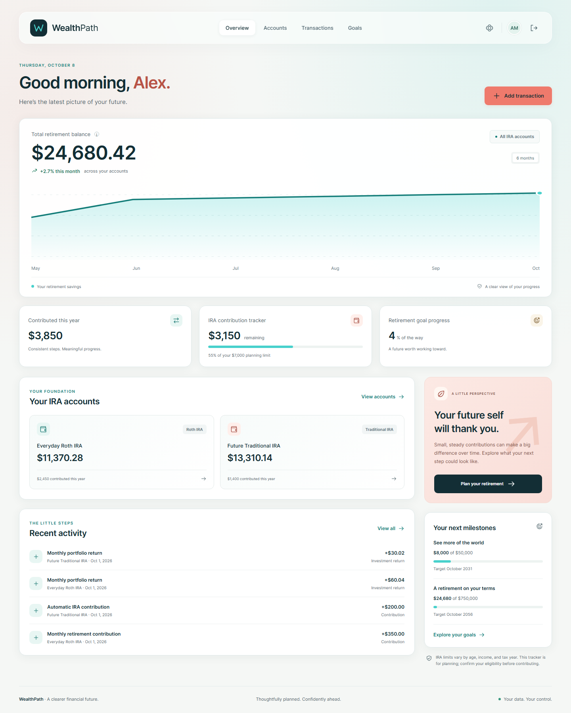
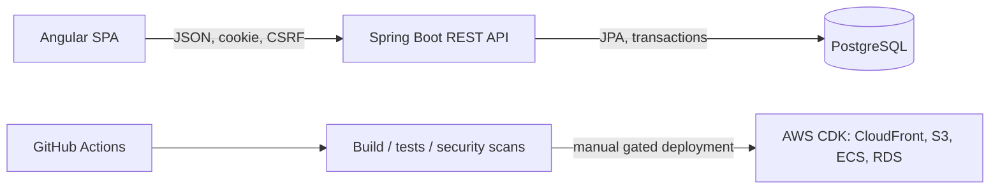

# WealthPath

[](https://github.com/DiegoSanchez717/Monelytics/actions/workflows/ci.yml)

**A clearer path to retirement.** WealthPath is a full-stack retirement finance application built in the [Monelytics repository](https://github.com/DiegoSanchez717/Monelytics). It uses Angular, TypeScript, JavaScript, HTML, CSS, Java, Spring Boot, PostgreSQL, Docker, and Amazon Web Services infrastructure.

The interface takes inspiration from the supplied dashboard reference: rounded navigation, a soft neutral background, generous balance charts, and `#48D1CC` teal / `#EF7A6C` coral accents. It has independent WealthPath branding and no company logos or proprietary assets.



## Features

- Registration, login, logout, protected routes, USER/ADMIN roles, and optional authenticator MFA.
- Dashboard with IRA balances, contribution progress, historical activity, account cards, and retirement milestones.
- Roth and Traditional IRA management, with beneficiary allocation validation.
- Transaction creation, editing, deletion, search, account/type/date filters, sorting, and pagination.
- Exact-decimal balances, atomic ledger changes, overdraft protection, and a configurable annual contribution policy.
- Retirement goals and a calculator with monthly compounding, zero-return handling, and transparent assumptions.
- Responsive layouts, keyboard navigation, labeled reactive forms, accessible SVG charts, and loading/error/empty/success states.
- Account-action audit events and an administrator audit viewer.
- OpenAPI/Swagger, Flyway migrations, structured JSON logs, request IDs, and health/readiness endpoints.
- Frontend/backend tests, PostgreSQL integration tests, live browser/API tests, container builds, security scanning, and gated GitHub Actions deployment.

WealthPath uses synthetic financial information. It does not hold or transfer funds, connect to banks, determine tax eligibility, or provide investment advice. The contribution threshold is an application planning policy; confirm actual eligibility and limits separately.

## Technology versions

| Layer | Technology |
|---|---|
| Browser | Angular 21.2.25, Angular CLI/build 21.2.26, TypeScript 5.9.3, RxJS 7.8 |
| UI assets | JavaScript runtime, semantic HTML, plain CSS, native SVG charts |
| API | Java 21, Spring Boot 4.0.8, Spring Security, JPA/Hibernate, Bean Validation |
| API tooling | Maven wrapper, Flyway, Spring Session JDBC, Actuator, springdoc OpenAPI 3.0.3 |
| Database | PostgreSQL 17.11 |
| Local runtime | Node.js 24.12+ within 24.x, Docker Desktop/Engine, Docker Compose |
| AWS definitions | TypeScript AWS CDK 2.272.0; lockfiles pin complete dependency trees |
| Testing | Angular/Vitest, JUnit/Mockito, Testcontainers, Playwright, axe-core |

Angular 21 is a maintained baseline compatible with the provided Node 24.12 environment. Compatibility follows the [official Angular version matrix](https://angular.dev/reference/versions); Java compatibility follows the [Spring Boot requirements](https://docs.spring.io/spring-boot/4.0/system-requirements.html). See each package lockfile and `backend/pom.xml` for exact transitive versions and security maintenance overrides.

## Run locally

Install Docker Desktop with Linux containers and Node.js 24.x. From the repository root:

```powershell
node scripts/run-local.mjs
```

This creates an ignored `.env` with random database/MFA secrets if one does not exist, builds all containers, runs migrations, and waits for health checks. Existing configuration and MFA keys are preserved.

- Application: **http://localhost:8080**
- Direct API/Swagger: **http://localhost:8081/swagger-ui/index.html**
- API health: **http://localhost:8081/actuator/health/readiness**

If a port is occupied, change `FRONTEND_PORT` or `BACKEND_PORT` in `.env` and run the command again. This workstation uses backend port **8082** because an existing unrelated service occupies 8081. The UI remains on 8080.

Equivalent explicit setup:

```powershell
node scripts/setup-local.mjs
docker compose up --build --wait --wait-timeout 300
docker compose ps
```

Stop without deleting data:

```powershell
docker compose down
```

PostgreSQL records persist in a named volume. Removing that volume deliberately resets all development data, users, and MFA enrollment. See [Docker instructions](docs/DOCKER.md).

### Demo accounts

| Role | Email | Local password |
|---|---|---|
| User | `demo@wealthpath.dev` | `DemoPath!2026` |
| Administrator | `admin@wealthpath.dev` | `AdminPath!2026` |

These are public synthetic demo credentials, seeded only when enabled. `.env` can override passwords on first initialization; it does not reset existing users on restart. Production disables demo seeds.

### Develop outside containers

Prerequisites: Java 21, Node.js 24.x, and Docker. Maven is supplied by the wrapper.

```powershell
node scripts/setup-local.mjs
docker compose -f docker-compose.yml -f docker-compose.dev.yml up -d database
```

Set `DATABASE_URL=jdbc:postgresql://localhost:5432/wealthpath`, `DATABASE_USERNAME`, `DATABASE_PASSWORD`, and `MFA_ENCRYPTION_KEY` from your ignored `.env`. For local demo data set `DEMO_ENABLED=true`, `DEMO_PASSWORD`, and `ADMIN_PASSWORD`. Keep `COOKIE_SECURE=false` for loopback HTTP. Then, in separate terminals:

```powershell
cd backend
./mvnw.cmd spring-boot:run
```

```powershell
cd frontend
npm.cmd ci
npm.cmd start
```

Angular serves on http://localhost:4200 and proxies `/api` to localhost:8080. On Linux/macOS use `./mvnw`, `npm`, and environment assignment syntax for your shell. Do not run native API port 8080 while Compose frontend already occupies that port; use one development mode at a time.

## Architecture



`frontend/` contains typed API services, guards/interceptors, shared presentation components, and lazy feature routes. `backend/` separates controllers, DTOs, domain services, repositories, entities, validation, and security. Monetary changes and audit records commit together. Sessions reside in PostgreSQL so AWS API replicas share authentication.

The REST contract is documented in [API.md](docs/API.md) and generated OpenAPI. See [architecture diagrams](docs/ARCHITECTURE.md) and the [database schema](docs/DATABASE.md).

## Configuration

Local variables are described in `.env.example`. The database password and stable 32-byte base64 MFA encryption key must remain outside source control. `COOKIE_SECURE`, `DEMO_ENABLED`, and `API_DOCS_ENABLED` differ between local and cloud deployment. `CONTRIBUTION_LIMIT` changes the educational planning threshold; it is not a substitute for reviewed tax rules.

Production obtains credentials and the encryption key from Secrets Manager, runs behind HTTPS, and disables demo accounts and public Swagger. Logs omit credential payloads and contain request IDs. Review [SECURITY.md](docs/SECURITY.md) for implemented controls, the threat model, and remaining controls for real financial information.

## Test and build

```powershell
cd frontend
npm.cmd ci
npm.cmd run lint
npm.cmd test
npm.cmd run build
```

```powershell
cd backend
./mvnw.cmd verify
./mvnw.cmd verify -Ppostgres-it
```

The PostgreSQL profile requires a running Docker engine. Live full-stack checks:

```powershell
cd tests/e2e
npm.cmd ci
npx.cmd playwright install chromium
npm.cmd test
```

Infrastructure checks:

```powershell
cd infrastructure
npm.cmd ci
npm.cmd test
npm.cmd run synth -- --quiet
```

See [TESTING.md](docs/TESTING.md) for verification results and conditions. CI repeats the relevant checks, builds both runtime images, scans them with Trivy, runs the Compose/browser suite, and blocks deployment unless checks pass.

## AWS deployment

The CDK stack defines private S3 delivery through CloudFront, ECR image assets, ECS Fargate tasks behind an HTTPS ALB, private encrypted Multi-AZ RDS PostgreSQL, Secrets Manager integration, CloudWatch logs/alarms, ACM certificate integration, and optional Route 53 records. API caching is disabled and session/CSRF headers are forwarded on the same origin.

AWS resources are **not provisioned by local setup**. Supply an AWS account and deployment role, regional API certificate and origin DNS name, stable MFA secret, CDK bootstrap, and optional custom-domain viewer certificate. Configure GitHub OIDC/environment variables and review the costs before triggering deployment. Detailed prerequisites, deployment, estimated costs, and teardown are in [AWS-DEPLOYMENT.md](docs/AWS-DEPLOYMENT.md).

## More documentation

- [Security](docs/SECURITY.md), [testing](docs/TESTING.md), and [troubleshooting](docs/TROUBLESHOOTING.md)
- [Code walkthrough](docs/CODE-WALKTHROUGH.md) and [interview guide](docs/INTERVIEW-GUIDE.md)
- [Resume bullets grounded in the implementation](docs/RESUME-BULLETS.md)

Planning limitations are intentional and documented: no real financial connections, no tax eligibility engine, independently tracked goal amounts, no self-service account/MFA recovery, and no claimed regulatory certification. Cloud deployment and operational recovery exercises require separate account configuration.
