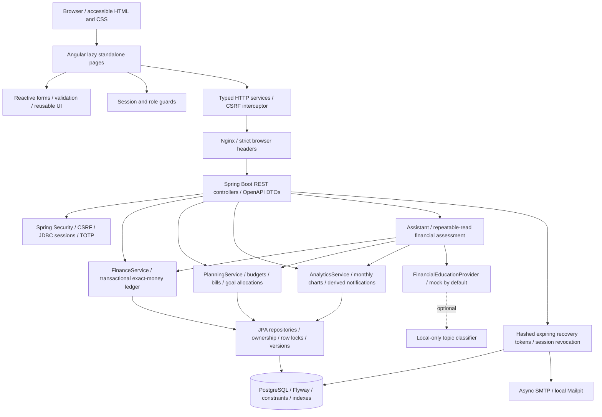
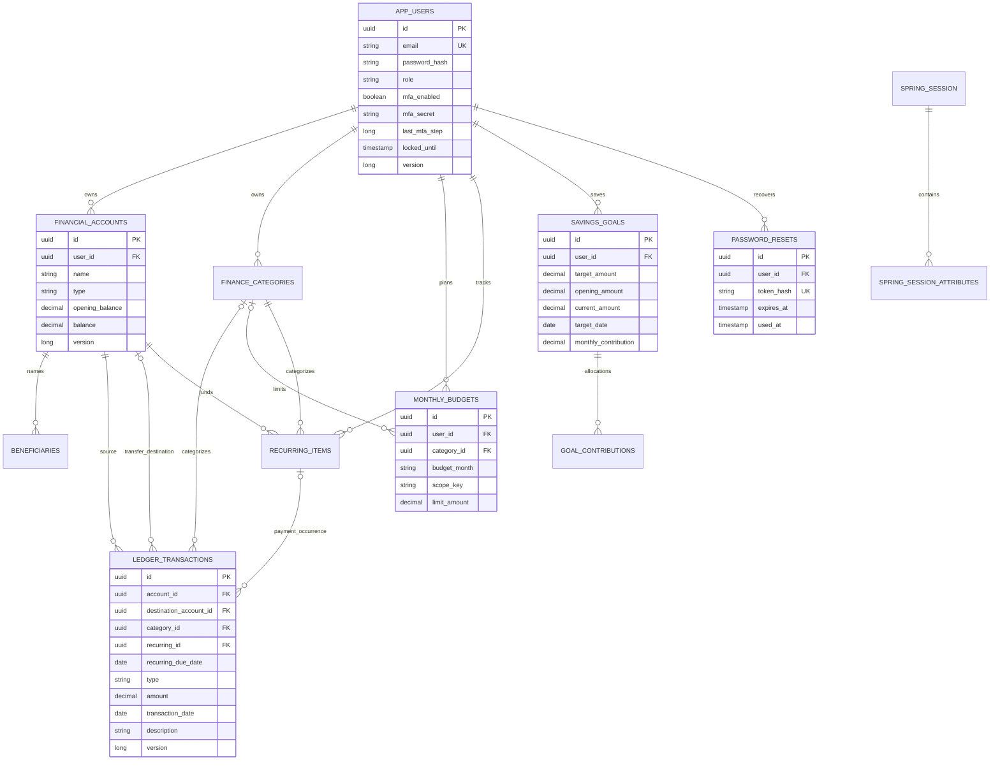

# Architecture and database schema

Monelytics is an Angular/TypeScript single-page application and Java21/Spring Boot REST API, backed by PostgreSQL17. Docker Compose runs Nginx, the API, PostgreSQL and a local Mailpit mailbox. All browser API requests use the same origin.

## Entity relationships

`audit_events` stores actor UUID, action, resource UUID, a safe detail and timestamp. Principal UUIDs in Spring Session associate sessions with users; they are not JPA foreign keys. Beneficiaries have names, relationships and exact percentage allocations. Categories have an owner, normalized unique name, INCOME/EXPENSE type and color. Goal contributions store amount, date and note. Recurring items store kind, account/category, amount, frequency, next date, anchor day, active flag and version.

## Business invariants

- Money is PostgreSQL NUMERIC(19,2) and Java BigDecimal. Non-credit accounts cannot overdraw. Negative credit balances represent debt.
- Income credits and expenses debit an account. A transfer is one ledger entry with owned source/destination accounts, atomically updates both and is excluded from income/expense aggregates. Updates reverse the old effect before applying the new effect inside the same transaction.
- Owner locks serialize account writes; deterministic account lock ordering prevents opposite-transfer deadlocks. Optimistic versions and database constraints protect concurrent edits and enforce valid types, positive amounts and valid transfer pairs.
- Overall monthly budgets have a null category and `scope_key=ALL`; category budgets have the category scope. Uniqueness is per user/month/scope. Analytics calculates actual spending and uses the tighter overlapping budget for affordability.
- Recurring payments carry a unique `(recurring_id, recurring_due_date)` pair. Retrying an occurrence returns its existing expense and cannot debit twice. Recurrence retains its anchor day across short months. Removing a payment reverses its recorded balance effect and reopens that occurrence.
- Goal totals equal an editable opening allocation plus recorded contributions. Updating goals cannot erase contribution history or create a negative opening allocation. Goal allocations do not automatically change account balances.
- Notifications are derived from current records, rather than a background service pretending to schedule bank payments. Dismissal is for the browser visit, not a durable delivery acknowledgment.
- The assistant reads one repeatable-read assessment snapshot. Local model calls happen after that transaction finishes. Providers cannot access mutation services. Model output selects reviewed education from an allowlist; balances, factors and decisions remain deterministic.

## Migration and operations

V1–V3 preserve the original schema/session history. The V4 Java Flyway migration discovers database-generated legacy checks, safely expands account/transaction types, preserves table data, and creates the finance planning tables/indexes. V5 adds hashed recovery tokens. Hibernate validates, rather than creates, production schema. Real PostgreSQL integration tests verify migration behavior and concurrent financial operations; H2 provides faster API tests.

JSON logs carry correlation IDs. Readiness includes PostgreSQL health. Compose waits for dependencies and reloads Nginx when the API is recreated. API images run as non-root. Environment variables hold private secrets; the MFA encryption key must survive restarts and be backed up with the database.

AWS CDK is an offline **reference**, not the current runtime. Its EC2/EBS/VPC/IAM/SSM/CloudFormation resources are all provisioning-disabled, and repository deploy commands refuse AWS calls. See [AWS instructions](AWS-DEPLOYMENT.md).
