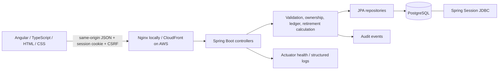
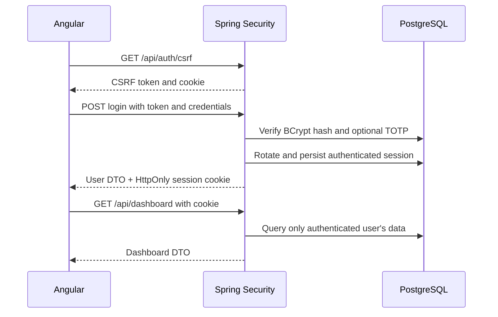
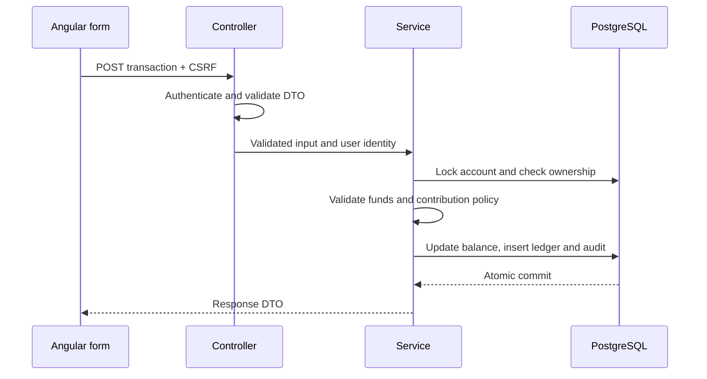

# WealthPath architecture

WealthPath is an Angular single-page application, a Java 21 Spring Boot REST service, and PostgreSQL. It manages synthetic retirement accounts rather than connecting to banks. The repository remains named Monelytics; the application name is WealthPath.

## Boundaries

Angular feature components own presentation and reactive forms. Core services own typed HTTP communication and authentication state. Route guards improve navigation; authorization is enforced independently by the API. An interceptor adds the CSRF header to mutations and normalizes authentication failures. Routes load feature bundles on demand. Charts use accessible SVG and textual summaries, avoiding an unnecessary visualization dependency.

Controllers accept validated request DTOs and return response DTOs. Services own transactions, ownership checks, account balance changes, contribution policies, beneficiary allocation, projections, and audit events. JPA repositories execute database queries. Entities never cross the API boundary. Flyway owns the schema; Hibernate validates it at startup.

Money uses Java `BigDecimal` and PostgreSQL `NUMERIC`, with two decimal places for ledger entries. A transaction edit reverses the original effect and applies the replacement inside one database transaction. Database locking protects concurrent updates; failed validation leaves the original ledger intact.

Retirement goals are planning scenarios with an independently entered current amount, target, date, planned monthly contribution, and assumed annual return. A goal is not a separate bank account and does not move funds. Projections use monthly compounding and end-of-month contributions; zero-return scenarios use a separate formula to avoid division by zero. Assumptions are educational, not forecasts or tax advice.

## Authentication

Server-side sessions expire after inactivity and reside in PostgreSQL, enabling multiple ECS replicas without sticky sessions. Production uses Secure, HttpOnly, SameSite cookies. Tokens and passwords are not stored in browser localStorage.

## Transaction lifecycle

## Reliability and deployment

Nginx and CloudFront keep API calls on the frontend origin. API responses are never cached. PostgreSQL indexes support ownership filters and dated ledger pagination. Structured logs carry request IDs, and readiness checks include database availability. Docker packages reproducible builds. AWS CDK describes the cloud resources; GitHub Actions gates deployment on builds, tests, and security scans.

The current design favors a comprehensible modular service over microservices. PostgreSQL holds both financial records and sessions, simplifying deployment at this scale. Before a high-volume deployment, measure contention, size pools against task count, replace per-process throttling with a shared edge limiter, and set recovery objectives through restore drills.
