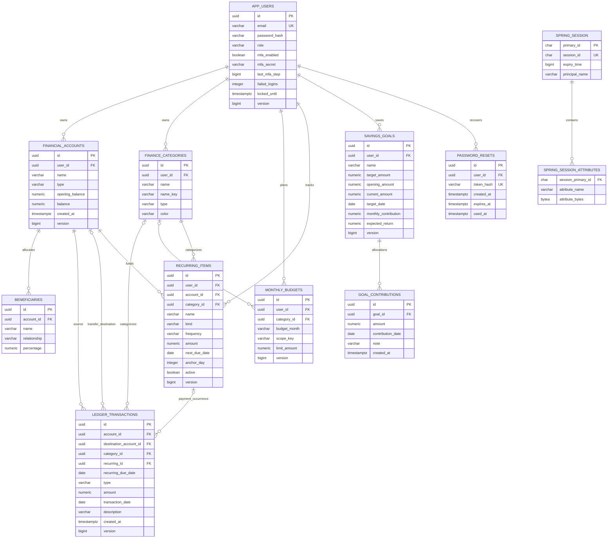

# Database schema

PostgreSQL is the production database. UUIDs are application-generated, monetary values use `NUMERIC(19,2)`, and Java calculations use `BigDecimal`. Hibernate uses `ddl-auto: validate`; Flyway owns schema changes. H2 is a fast test fixture, and Testcontainers verifies migrations and concurrent finance operations against PostgreSQL 17.

## Migrations

| Version | Location | Purpose |
| --- | --- | --- |
| V1 | `backend/src/main/resources/db/migration/V1__initial_schema.sql` | Users, original accounts/goals, beneficiaries, ledger and audit |
| V2 | `backend/src/main/resources/db/migration/V2__shared_sessions.sql` | Shared JDBC sessions and indexes |
| V3 | `backend/src/main/resources/db/migration/V3__invalidate_legacy_security_sessions.sql` | Invalidate sessions for a framework serialization upgrade |
| V4 | `backend/src/main/java/db/migration/V4__general_personal_finance.java` | Preserve portfolio data while expanding accounts, transfers, categories, budgets, bills and savings allocations |
| V5 | `backend/src/main/resources/db/migration/V5__password_recovery.sql` | Hashed, expiring recovery tokens |

V4 is a Java Flyway migration. It discovers database-generated legacy CHECK names, renames account/goal tables to their current general-finance names, expands allowed types and preserves ledger, beneficiary, goal and balance records. Existing goals' `opening_amount` starts at saved `current_amount`. V1-V3 checksums remain unchanged. V3 requires existing users to sign in again; mixed major-framework session serializers require a maintenance rollout.

Never change an applied migration in a shared environment. Add a new version, back up the database and stable MFA key, and verify restoration before upgrades. Demo initialization is separate from migration history.

## Relationships

`audit_events` additionally stores `id`, `actor_id`, `action`, `resource_id`, `detail` and `occurred_at`. Actor/resource UUIDs are historical identifiers, not foreign keys. Session `principal_name` contains the user's UUID but is not a JPA user foreign key. `mfa_secret` stores encrypted ciphertext, not the plaintext TOTP secret. Recovery stores a SHA-256 hash rather than the emailed token.

## Constraints and transactional rules

- Account type is CHECKING, SAVINGS, CREDIT_CARD, ROTH_IRA or TRADITIONAL_IRA. Non-credit balances/opening balances cannot be negative; negative credit-card balances represent debt.
- Ledger amounts are positive. A TRANSFER needs a different destination and no category; other types cannot have a destination. The service enforces ownership/category direction and atomically updates affected balances.
- Every finance mutation locks the owner, then affected accounts in deterministic order. Versions protect concurrent edits. Contribution totals are checked across the owner's IRA accounts in the same transaction.
- Category names are unique per owner using normalized `name_key`. In-use categories cannot be deleted or change INCOME/EXPENSE direction.
- Budgets are unique by `(user_id,budget_month,scope_key)`. Overall budgets use null `category_id` and `scope_key=ALL`; category scopes use the category UUID. This avoids NULL uniqueness differences. Actual use includes expenses only.
- Recurring payments have unique `(recurring_id,recurring_due_date)` pairs. Retry returns the prior expense. `anchor_day` preserves month-end schedules. Deleting a plan sets posted ledger links to null rather than removing expenses.
- Goal `current_amount` is editable nonnegative `opening_amount` plus recorded contributions. Contributions are independent allocations, not account movements. Goal contributions cascade when a goal is removed.
- Beneficiary percentages use `NUMERIC(5,2)`; nonempty allocations total 100% through service validation. Beneficiaries cascade with an eligible deleted account. Accounts cannot silently delete ledger history.
- Recovery links expire and are consumed under user/token locks. Reset invalidates outstanding tokens and deletes the user's stored sessions, retaining MFA.

## Queries, indexes and demo data

Account/goal ownership indexes created before V4 remain attached to renamed tables. Ledger indexes cover source/date, destination and category/date. Budget indexes cover owner/month, recurring indexes cover owner/due date, and contribution indexes cover goal/date. Audit timestamps, session expiry/principal and recovery owner/time are indexed. Normalized email is unique.

Dashboard/analytics use SQL aggregates for monthly income/expenses, contributions, spending categories and historical balance effects. Recent entries are paged. CSV export reads 500-row batches inside a repeatable-read transaction and clears managed entities between batches. It exports all matching owned records without loading the entire ledger into memory.

`DEMO_ENABLED=true` creates fictional demo users and six months of data: three general-finance accounts, ten categories, 82 ledger entries, 24 overall/category budgets, four recurring plans and three savings goals. Existing demo accounts/data are preserved rather than overwritten. Registration creates default categories without invented balances/activity. Use a deliberately disposable database volume for a fresh demonstration; never reset customer data to reseed an example.

See [architecture](ARCHITECTURE.md), [API](API.md) and [security](SECURITY.md).