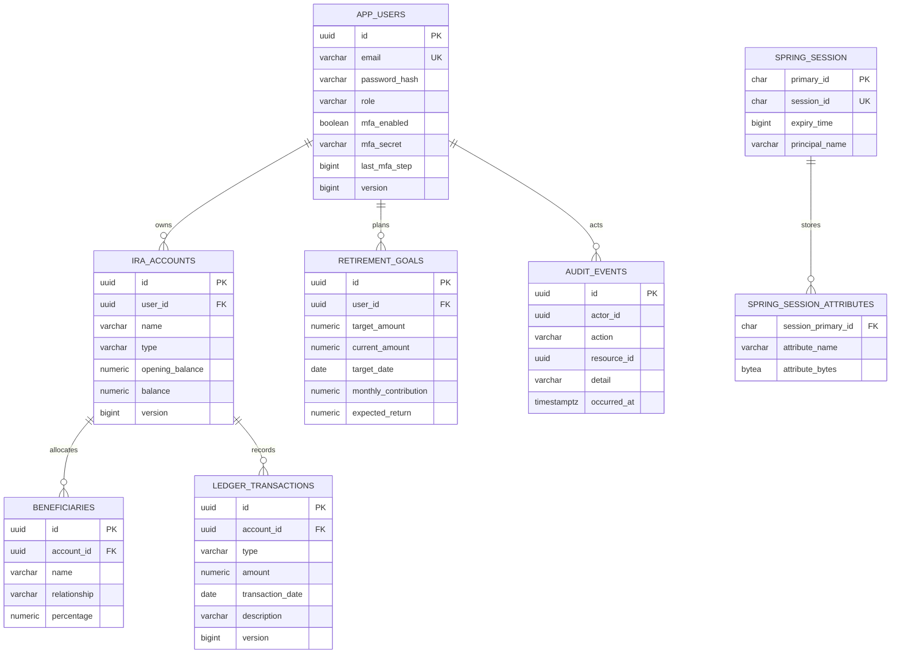

# Database schema

Flyway migrations in `backend/src/main/resources/db/migration` create PostgreSQL tables. UUIDs are application-generated. Hibernate uses `ddl-auto: validate`; it does not rewrite production schemas.

`V3` invalidates existing JDBC sessions when upgrading the Spring Security serialization format. Users sign in again; IRA accounts, beneficiaries, transactions, goals, and audit history remain intact. A deployment across different major framework versions should use a maintenance rollout rather than mixed session serializers.

`audit_events.actor_id` is a historical identifier, not a foreign key; the diagram describes its logical relationship. This preserves audit history independently of user lifecycle. Accounts cannot silently delete their ledger history. Beneficiary rows cascade with their account. Session attributes cascade with the session.

`NUMERIC(19,2)` stores account and transaction amounts; percentages use `NUMERIC(5,2)`. Check constraints reject negative balances and nonpositive transactions. The service additionally validates beneficiary totals and combined annual IRA contributions. Opening balances represent preexisting holdings, not new contributions.

Ownership indexes cover `ira_accounts.user_id` and `retirement_goals.user_id`. Ledger pagination uses `(account_id, transaction_date DESC)`. Audit events are indexed by timestamp; sessions by expiry and principal. Email is unique after normalization.

Synthetic demo data is populated by the application only with `DEMO_ENABLED=true`. Production disables that flag. Migration history is persistent. Add new versioned migrations for schema changes; never edit an already-applied migration in a shared environment. Back up PostgreSQL and verify restoration before upgrades.
